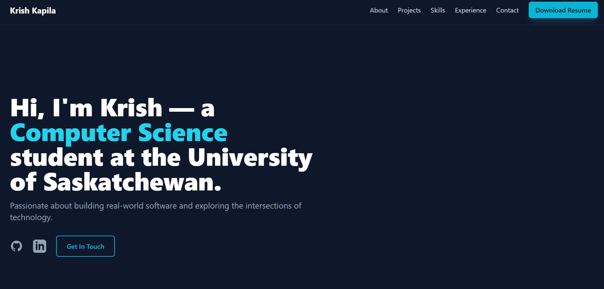

# 🌐 **Krish Kapila — Portfolio Website**  
### _Software Engineering • Cloud • Security • Full-Stack Development_

🔗 **Live Website:** https://portfolio-jade-iota-72.vercel.app/  

---

## 📌 **Overview**

This is the official portfolio website of **Krish Kapila**, a Computer Science student at the University of Saskatchewan, showcasing skills in **software development**, **AWS cloud**, **security**, and **full-stack engineering**.  

The website highlights:
- My development projects  
- Technical skills  
- Work experience  
- Academic journey  
- Contact information and social links  

Designed for clarity, performance, and a modern UI.

---

## 📸 Preview

---

## ✨ **Features**

### **📁 Projects Showcase**
A curated list of projects, including:
- Python CLI tools (e.g., Port Scanner)  
- AWS serverless apps  
- React + API projects  
- Networking & security experiments  

### **👤 About Me Section**
Covers:
- Academic background  
- Work experience (including part-time roles)  
- Campus involvement (Indian Student Association, volunteer work)  

### **🛠 Skills Section**
Highlights:
- **Languages:** Python, JavaScript  
- **Cloud:** AWS Lambda, API Gateway, DynamoDB, Cognito  
- **Frontend:** React, TailwindCSS  
- **Tools:** Git, Linux, Nmap, Burp Suite  

### **📱 Fully Responsive UI**
Optimized for:
- Mobile  
- Tablet  
- Desktop  

### **⚡ Fast Deployment With Vercel**
Instant builds, optimized static assets, and edge caching.

---

## 🧩 **Tech Stack**

| Category
